# Experiment 3: Deploying NGINX Using Different Base Images and Comparing Docker Image Layers

## Aim

To deploy the NGINX web server using different Docker base images and compare their image size, performance, layers, and security impact.

---

## Key Learning Points

This experiment explores how the choice of base image fundamentally impacts Docker container characteristics including footprint, startup time, security profile, and operational complexity.

---

## Prerequisites

- Docker installed and running
- Basic Linux commands
- Understanding of:
  - docker pull
  - docker run
  - docker build
  - Dockerfile fundamentals
  - Port mapping basics

---

# Theory

## What is NGINX?

NGINX is a high-performance server application that functions as:

- Web Server
- Reverse Proxy
- Load Balancer
- API Gateway

It uses an **event-driven asynchronous architecture**, making it faster and more scalable than traditional servers like Apache.

---

## What is Docker?

Docker is a containerization platform that:

- Packages applications with dependencies
- Ensures portability across environments
- Provides lightweight virtualization
- Speeds up deployment significantly

---

## What are Docker Image Layers?

Docker images are built in layers, where each instruction in a Dockerfile creates a distinct layer:

- FROM
- RUN
- COPY
- ADD

### Importance of Image Layers

- More layers → bigger image size
- Larger images → slower pull times
- Larger images → more potential vulnerabilities
- Fewer layers → faster performance and improved security

---

## Base Image Type Comparison

| Base Image | Characteristics |
|-----------|-------------|
| Official nginx | Pre-built, optimized for production |
| Ubuntu | Complete Linux OS with various tools |
| Alpine | Lightweight, minimal Linux distribution |

---

# Experiment Procedure

---

# Part 1: Deploy NGINX with Official Image

## Step 1: Pull the Image

```bash
docker pull nginx:latest
```

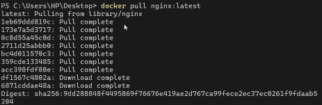

## Step 2: Run Container

```bash
docker run -d --name nginx-official -p 8080:80 nginx
```

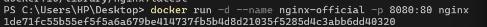

## Step 3: Verify Installation

```bash
curl http://localhost:8080
```

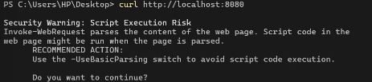

Or visit in browser: `http://localhost:8080`

---

## Observations

```bash
docker images nginx
```

Key characteristics:
- Pre-optimized configuration
- Minimal setup requirements
- Production-ready status
- Medium image size (~140MB)

---

# Part 2: Custom NGINX Using Ubuntu Base Image

---

## Step 1: Create Dockerfile

Create a file named `Dockerfile`:

```Dockerfile
FROM ubuntu:22.04

RUN apt-get update && \
    apt-get install -y nginx && \
    apt-get clean && \
    rm -rf /var/lib/apt/lists/*

EXPOSE 80

CMD ["nginx", "-g", "daemon off;"]
```

---

## Step 2: Build Image

```bash
docker build -t nginx-ubuntu .
```

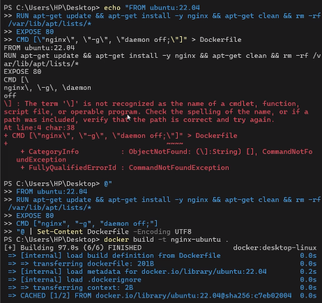

---

## Step 3: Run Container

```bash
docker run -d --name nginx-ubuntu -p 8081:80 nginx-ubuntu
```

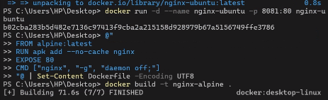

---

## Observations

```bash
docker images nginx-ubuntu
```

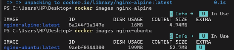

Characteristics:
- Large image footprint (~220MB+)
- Multiple filesystem layers
- Full OS overhead
- Slower startup time
- Larger attack surface

---

# Part 3: Custom NGINX Using Alpine Base Image

---

## Step 1: Create Dockerfile

```Dockerfile
FROM alpine:latest

RUN apk add --no-cache nginx

EXPOSE 80

CMD ["nginx", "-g", "daemon off;"]
```

---

## Step 2: Build Image

```bash
docker build -t nginx-alpine .
```

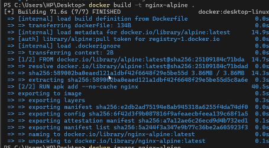

---

## Step 3: Run Container

```bash
docker run -d --name nginx-alpine -p 8082:80 nginx-alpine
```

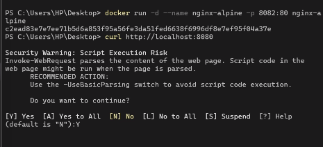

---

## Observations

```bash
docker images nginx-alpine
```

Key characteristics:
- Very compact size (~25–30MB)
- Minimal dependencies
- Fast pull operation
- Rapid startup time
- Enhanced security posture

---

# Part 4: Compare Image Sizes

## Command

```bash
docker images | grep nginx
```

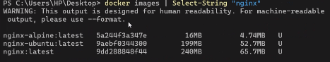

## Size Comparison

| Image Type   | Approximate Size |
|--------------|-----------|
| nginx:latest | ~140MB    |
| nginx-ubuntu | ~220MB+   |
| nginx-alpine | ~25MB     |

---

# Part 5: Inspect Image Layers

## View Layer Information

```bash
docker history nginx
docker history nginx-ubuntu
docker history nginx-alpine
```

## Analysis

- Ubuntu image → numerous filesystem layers from OS installation
- Alpine image → minimal layers due to lightweight design
- Official image → optimized and consolidated layers

---

# Part 6: Serve Custom HTML Page

## Step 1: Create HTML Content

```bash
mkdir html
echo "<h1>Welcome to NGINX in Docker</h1>" > html/index.html
```

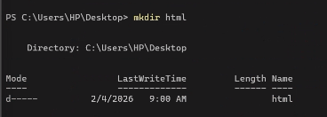

## Step 2: Run Container with Volume Mounting

```bash
docker run -d \
  -p 8083:80 \
  -v $(pwd)/html:/usr/share/nginx/html \
  nginx
```

## Step 3: Access the Application

Open browser and navigate to: `http://localhost:8083`

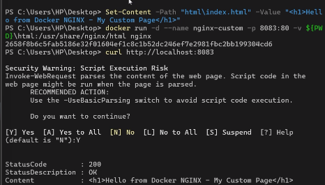

---

# Part 7: Real-World NGINX Applications

NGINX is commonly deployed for:

- Serving static website content
- Functioning as reverse proxy
- Load balancing across servers
- SSL/TLS termination
- API gateway functionality
- Kubernetes ingress controller
- Microservices frontend router

---

# Comparison Summary

| Feature | Official | Ubuntu | Alpine |
|-----------|------------|-----------|-----------|
| Size | Medium | Large | Very Small |
| Startup Time | Fast | Slow | Very Fast |
| Security Profile | Medium | Low | High |
| Debugging Capabilities | Limited | Good | Minimal |
| Production Ready | Yes | Rare | Yes |

---

# When to Use Each Image

## Official Image
- Production deployment scenarios
- Reverse proxy implementations
- Standard web hosting environments

## Ubuntu Image
- Educational and learning purposes
- Situations requiring debugging tools
- Applications with heavy dependencies

## Alpine Image
- Cloud environment deployments
- Microservices architectures
- CI/CD pipeline containers
- Kubernetes cluster deployments

---

# Lab Exercises

1. Measure image pull time for each variant
2. Add custom NGINX configuration files
3. Modify default port assignments
4. Implement basic authentication
5. Optimize and reduce layer count
6. Compare and document:
   - Reasons for image size differences
   - Production suitability of Ubuntu images

---

# Verification Questions

1. What functions does NGINX provide?
2. What is Docker's primary purpose?
3. How do Docker image layers work?
4. Why are Alpine images smaller in size?
5. What are the key differences between Ubuntu and Alpine images?
6. Why are official images preferred for production?
7. What is a reverse proxy and how does NGINX use it?
8. How does NGINX improve application performance?

---

# Key Takeaways

Upon completing this exercise, professionals can:

- Deploy web servers efficiently within containerized environments
- Construct optimized Docker images from custom specifications
- Minimize container image footprint effectively
- Comprehend container layer architecture and dependencies
- Apply security best practices in image construction
- Deploy NGINX effectively in production scenarios

---

# Conclusion

This experiment demonstrates several important principles:

- Official images provide stability and production readiness
- Ubuntu images are larger and slower, limiting their use in production
- Alpine images are lightweight, faster, and provide better security

Therefore, Alpine or Official images are strongly preferred for real-world production deployments, with Ubuntu images reserved for development and learning scenarios.

---

# End of Experiment
