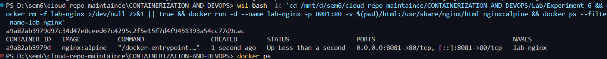
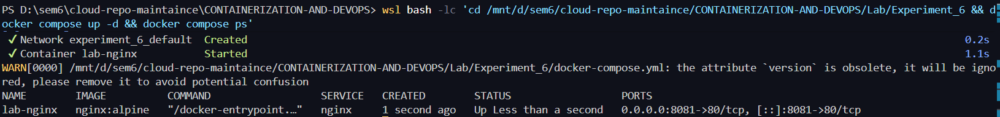
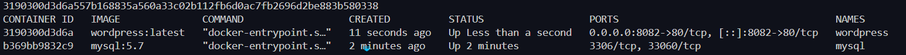
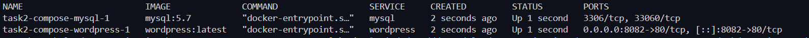
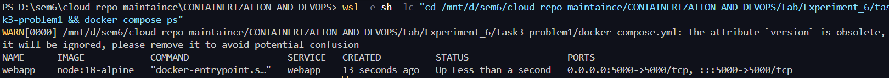
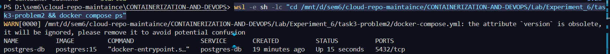
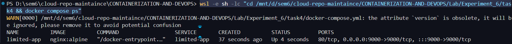
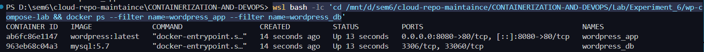
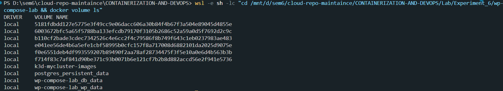
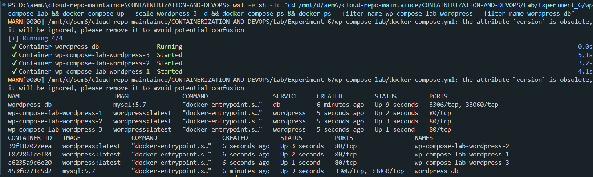

# Experiment 6: Docker Run vs Docker Compose and Multi-Container Applications

## Aim

To compare manual container deployment using `docker run` with declarative orchestration using Docker Compose, and to implement multi-container applications with custom builds, scaling, and persistence.

---

## Objective

This experiment demonstrates:

1. Single-container setup using both `docker run` and Docker Compose.
2. Multi-container setup (WordPress + MySQL) with networking and volumes.
3. Conversion of `docker run` commands into `docker-compose.yml` files.
4. Building custom Docker images and multi-stage Dockerfiles using Compose.
5. Scaling containers and observing Docker Swarm basics.

---

## Part A: Docker Run vs Docker Compose (Theory)

`docker run` is useful for quick tests, but Docker Compose is better for repeatable and maintainable multi-service setups.

| Docker Run Flag | Purpose | Docker Compose Equivalent |
| --- | --- | --- |
| `--name` | Assign container name | `container_name:` |
| `-p host:container` | Port mapping | `ports:` |
| `-e KEY=VALUE` | Environment variables | `environment:` |
| `-v host:container` | Bind/volume mount | `volumes:` |
| `--network` | Custom network | `networks:` |
| `--restart` | Restart policy | `restart:` |
| `--memory`, `--cpus` | Resource constraints | `deploy.resources.limits:` |
| `--depends-on` (manual order) | Dependency handling | `depends_on:` |

---

## Part B: Practical Tasks

### Task 1: Single Container (Nginx)

#### Using Docker Run

```bash
docker rm -f lab-nginx >/dev/null 2>&1 || true
docker run -d --name lab-nginx -p 8081:80 -v $(pwd)/html:/usr/share/nginx/html nginx:alpine
docker ps --filter name=lab-nginx
```



*Figure 1: Nginx started with `docker run` and port mapping on 8081.*

#### Using Docker Compose

```bash
docker compose up -d
docker compose ps
```



*Figure 2: Nginx started using Docker Compose.*

---

### Task 2: Multi-Container Application (WordPress + MySQL)

#### Using Docker Run

```bash
docker network create wp-net || true
docker volume create mysql_data

docker run -d --name mysql --network wp-net \
	-e MYSQL_ROOT_PASSWORD=secret \
	-e MYSQL_DATABASE=wordpress \
	-v mysql_data:/var/lib/mysql \
	mysql:5.7

docker run -d --name wordpress --network wp-net \
	-p 8082:80 \
	-e WORDPRESS_DB_HOST=mysql \
	-e WORDPRESS_DB_PASSWORD=secret \
	wordpress:latest

docker ps --filter name=mysql --filter name=wordpress
```



*Figure 3: WordPress and MySQL running using manual `docker run` commands.*

#### Using Docker Compose

```bash
cd task2-compose
docker compose up -d
docker compose ps
```



*Figure 4: WordPress + MySQL launched through Compose file.*

---

## Part C: Docker Run to Compose Conversion

### Task 3 (Problem 1): Basic Web App Conversion

Convert:

```bash
docker run -d --name webapp -p 5000:5000 \
	-e APP_ENV=production -e DEBUG=false \
	--restart unless-stopped node:18-alpine
```

Run and verify:

```bash
cd task3-problem1
docker compose up -d
docker compose ps
```



*Figure 5: Converted single webapp command into Compose service.*

### Task 3 (Problem 2): Volume + Network Conversion

Run and verify:

```bash
cd task3-problem2
docker compose up -d
docker compose ps
```



*Figure 6: Compose setup with custom network and PostgreSQL service.*

### Task 4: Resource Limits Conversion

Convert memory and CPU constraints into Compose:

```bash
cd task4
docker compose up -d
docker compose ps
```



*Figure 7: Resource-limited service running from Compose configuration.*

---

## Part D: Dockerfile Build Tasks with Compose

### Task 5: Custom Dockerfile Build

```bash
cd task5
docker compose up -d --build
docker exec custom-node-app wget -qO- http://localhost:3000
```


*Figure 8: Custom Node.js app built and verified using Compose.*

### Task 6: Multi-Stage Dockerfile Build

```bash
cd task6
docker compose up -d --build
docker images | grep -E 'task|node|prod'
```


*Figure 9: Multi-stage Docker image built and compared with other images.*

---

## Part E: WordPress + MySQL Full Compose Lab

### Step 1: Start Services

```bash
cd wp-compose-lab
docker compose up -d
docker ps --filter name=wordpress_app --filter name=wordpress_db
```



*Figure 10: WordPress and MySQL services up in Compose lab.*

### Step 2: Verify Named Volumes

```bash
docker volume ls
```



*Figure 11: Persistent named volumes for database and WordPress content.*

### Step 3: Scale WordPress Replicas

```bash
docker compose up --scale wordpress=3 -d
docker ps --filter name=wp-compose-lab-wordpress --filter name=wordpress_db
```



*Figure 12: Scaled WordPress replicas with MySQL backend.*

---

## Observation

| Feature | Observation |
| --- | --- |
| Configuration Management | Compose is cleaner and easier to maintain than long `docker run` commands. |
| Multi-Container Setup | Compose simplifies dependency, network, and volume handling. |
| Reproducibility | YAML-based definitions improve repeatability and team collaboration. |
| Scaling | Compose supports quick replica scaling for local experiments. |
| Build Workflow | Compose integrates Dockerfile build and runtime commands in one flow. |

---

## Result

All required tasks were successfully completed using both manual `docker run` and Docker Compose approaches. Multi-container applications, custom builds, persistent volumes, and scaling were tested and verified.

---

## Conclusion

Docker Compose is more suitable for structured and scalable containerized applications because it provides declarative configuration, easier service lifecycle control, and better maintainability compared to manual `docker run` commands.

---
